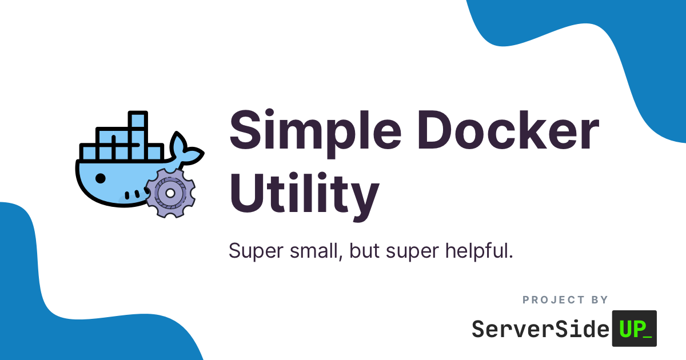

		

	
	
	
  
	

# About this project
We're taking the extra effort to open source as much as we can. Not only could this potentially help someone learn a little bit of Docker, but it makes it a *heck of a lot* easier for us to work with you on new open source ideas.

# What this image does
It's stupid simple...

Rather than building this manually on every run, we decided to make the image publicly available.

* It's based off of Docker-In-Docker
* We add `docker compose` (v2) to it
* We may also add other small utilities to it

# Questions
Open up an issue and we'll get back to you!
